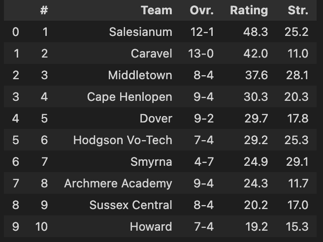
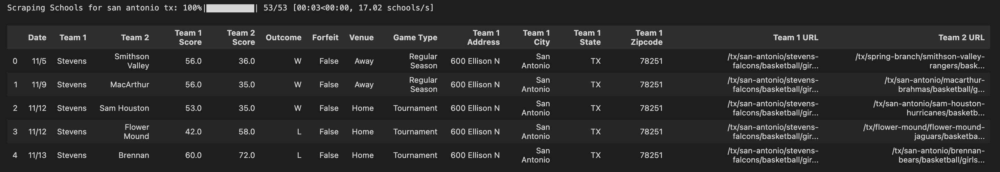

# MaxPreps Web Scraper

This Python module scrapes high school sports data from [MaxPreps.com](https://www.maxpreps.com), enabling efficient extraction of team rankings and game results across states and sports.

## Features

- Retrieve team rankings with strength of schedule, rating, and team links.
- Scrape team schedules, game outcomes, rankings
- Includes address/location data for each team.
- Multi-threaded scraping for speed and efficiency.
- Cleans and structures game metadata (venue, game type, outcome, etc.).

##  File Structure

- `scraper.py`: Contains the `MaxPrepsScraper` class 

## ️ Installation

```bash
pip install requests beautifulsoup4 pandas tqdm
```
##  Functions

##### `get_rankings(state: str, sport: str, year: str, boys: bool = True)`

Retrieves state rankings for a given sport and academic year.
**Parameters:**
- `state` (`str`): Two-letter state abbreviation (e.g., `'tx'` for Texas)
- `sport` (`str`): Sport name (e.g., `'basketball'`)
- `year` (`str`): Academic year of the season (e.g., `'21-22'`)
- `boys` (`bool`, optional): Set to `True` for boys' sports and `False` for girls'. Defaults to `True`.

**Returns:**  
`pandas.DataFrame` containing:
- School Name
- State Rank
- Strength of Schedule (SOS)
- Team Rating
- Team URL

---

##### `get_contests(state: str, sport: str, year: str, boys: bool = True, cities: list = None)`

Scrapes all contests (games) for selected schools by state, sport, and year.
**Parameters:**
- `state` (`str`): Two-letter state abbreviation (e.g., `'tx'`)
- `sport` (`str`): Sport name (e.g., `'basketball'`)
- `year` (`str`): Academic year of the season (e.g., `'21-22'`)
- `boys` (`bool`, optional): Set to `True` for boys' sports and `False` for girls'. Defaults to `True`.
- `cities` (`list`, optional): A list of cities to filter for, e.g., `['austin', 'el paso']` (if omitted, full state will be scraped)

**Returns:**  
`pandas.DataFrame` containing game-level contest data, including:
- Date, opponent, venue, scores
- Team location details (address, city, state, zipcode)
- URLs to the MaxPreps pages of both teams

#### Supported Sports and Limitations
These functions only support the following sports:
['basketball', 'football', 'baseball', 'soccer', 'volleyball', 'lacrosse', 'softball']

⚠️ Note: Soccer data is only available for the following states:
['tx', 'la', 'ms', 'hi', 'ca', 'fl', 'az']
## Usage and Example Output
```
from scraper import MaxPrepsScraper
scraper = MaxPrepsScraper()

# Get Team Rankings
rankings_df = scraper.get_rankings(state = 'de', sport = 'football', year = '23-24')

# Get Contest Data
contests_df = scraper.get_contests(state='tx', sport='basketball', year='21-22', boys=False, cities = ['san antonio'])

#output datframes
rankings_df.head(10)
contests_df.head(10)
```




